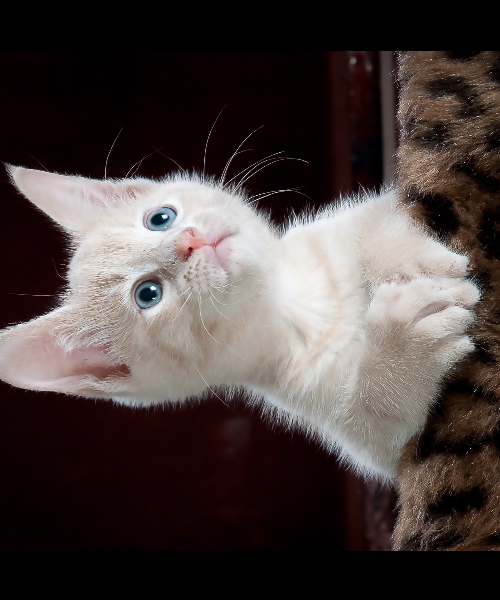
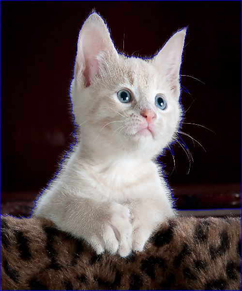
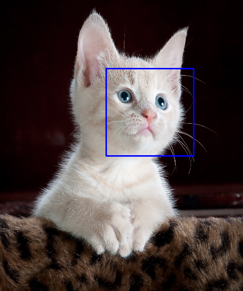

# Image-Processing
Video and Image Analysing using OpenCV - Python

## Video
Implementation interactive video using MOG2, KNN function for foreground and background subtracting and other trick for improve accuracy.

* Snowing

* Object Motion

 

## Image
Some low level and high level image processing function tested like:  
* Edge Detection

  
  
* Smoothing Image using Gaussian kernel

  
  
* Rotation, Drawing Image, Resize

  

* Segmentation 

  
  
* Face Detection

  
